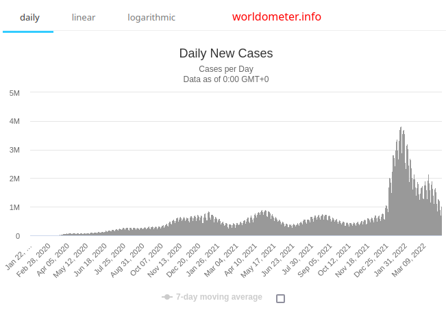
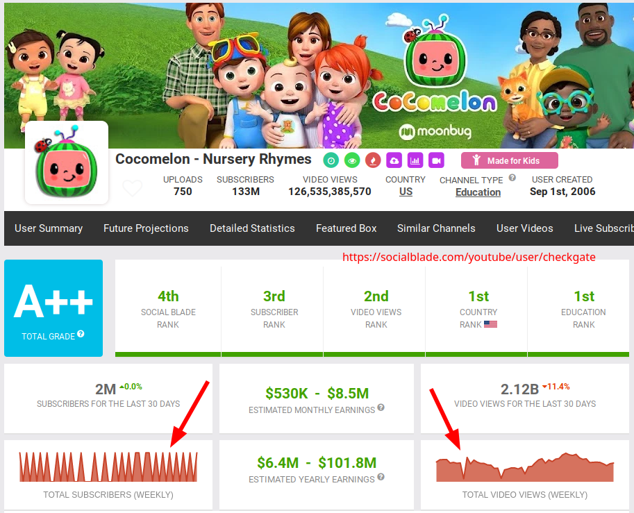
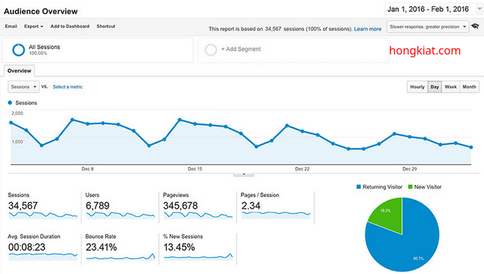

# Pertemuan 7 Basis Data - Pendekatan Basis Data Relasional dalam Penyelesaian Kasus Data Historical dan Kompleks

## Pemodelan Data Historis

### Mengapa beberapa jenis data disimpan secara historis ?
- Indikator pembangunan dalam sebuah wilayah
  - Populasi penduduk Jawa Barat tahun 2010, 2011, 2012, 2013, dst.
  - Tingkat kemiskinan penduduk Kota Surabaya tahun 2015, 2016, 2017, dst. 
- Kepadatan lalu lintas ruas-ruas jalan di Kota Bandung per menit
- Jumlah kasus Covid 19 harian di Dunia

  
- Jumlah subscriber dan video dilihat per minggu

  
- Trafik website harian di Google Analytics

  

## Pengantar dan Contoh Penggunaan Basis Data Relasional

### Membuat Tabel

### Query Data

## Materi Terkait
- [Changes & Historical Modeling](https://sqldatabasetutorials.com/sql-db-section/changes-historical-modeling/)
- [Relational Database](https://sqldatabasetutorials.com/sql-db/relational-database/)
